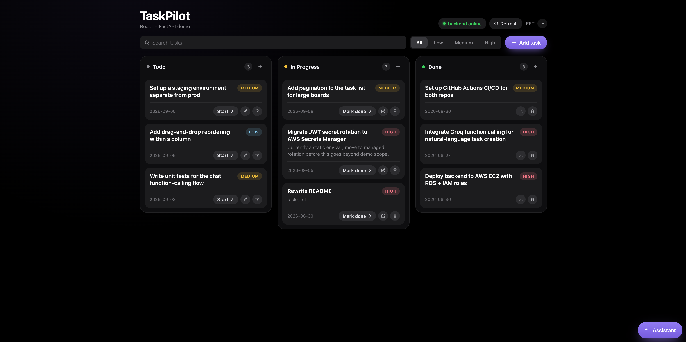

# TaskPilot

A Kanban task board with account-based auth and an AI assistant that turns plain-English messages into tasks. Built to practice full-stack integration end to end — React/TypeScript frontend, FastAPI backend, MySQL — containerized and deployed to AWS.

**Backend repo:** [taskpilot-api](https://github.com/evtyy/taskpilot-api) · **Live demo:** _add your deployed URL here_

<!-- Add a screenshot or short GIF of the board here — e.g.  -->

## Features

- Kanban board — create, edit, delete, and advance tasks across todo → in progress → done with one click, with search and priority filters
- Login/register with JWT auth; the board and its API are gated behind a real account
- AI chat assistant — describe a task in plain English and an LLM (Groq, GPT-OSS-20B) decides whether to create it via function calling; the model only proposes the call, the backend is what actually writes to the database
- Optimistic UI updates, with automatic rollback if a request fails
- Multi-stage Docker build served by Nginx, deployed to AWS (EC2 + ECR) via GitHub Actions

## Tech Stack

React 19 · TypeScript · Vite · Axios · Nginx · Docker

## Quick Start

Needs the [backend](https://github.com/evtyy/taskpilot-api) running too — see that repo for setup.

```bash
git clone https://github.com/evtyy/taskpilot-frontend.git
cd taskpilot-frontend
npm install
cp .env.example .env      # set VITE_API_URL to wherever the backend is running
npm run dev
```

Runs at `http://localhost:5173`. Note: `VITE_API_URL` is baked in at build/start time — after changing `.env`, restart `npm run dev` rather than just saving the file.

## Project Structure

```
src/
├── api/client.ts       # axios instance, auth token handling, all backend calls
├── types/               # Task and auth type definitions
├── hooks/                 # useTasks, useAuth, useBackendStatus
└── components/               # board UI, login page, chat panel
```
